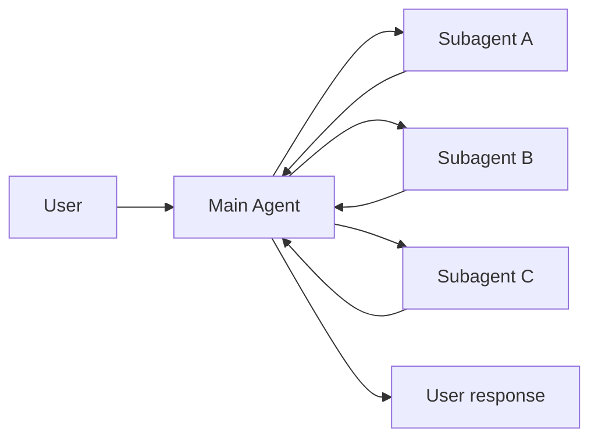
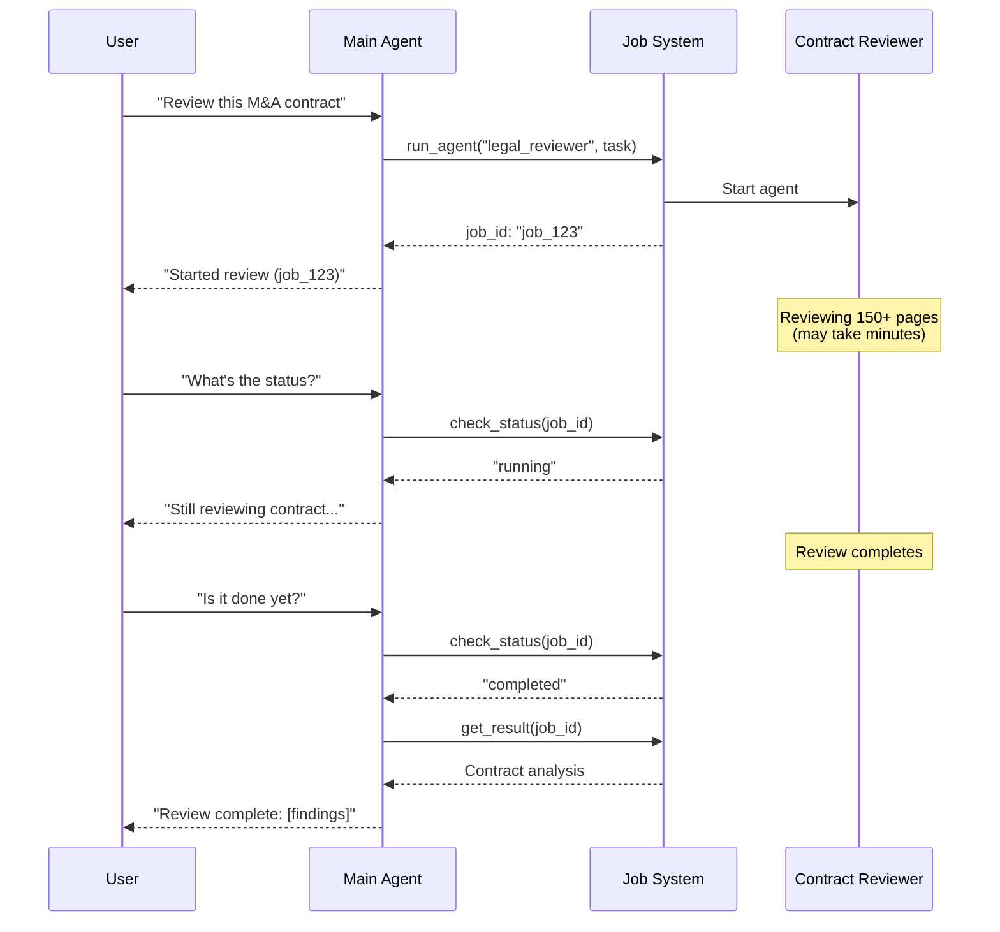
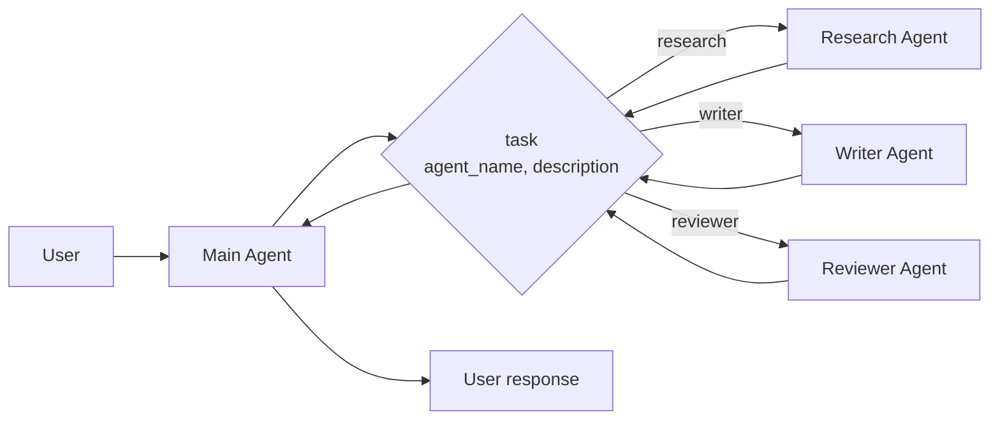

In the **subagents** architecture, a central main [agent](/oss/python/langchain/agents) (often referred to as a **supervisor**) coordinates subagents by calling them as [tools](/oss/python/langchain/tools). The main agent decides which subagent to invoke, what input to provide, and how to combine results. Subagents are stateless—they don't remember past interactions, with all conversation memory maintained by the main agent. This provides [context](/oss/python/langchain/context-engineering) isolation: each subagent invocation works in a clean context window, preventing context bloat in the main conversation.



## Key characteristics

* Centralized control: All routing passes through the main agent
* No direct user interaction: Subagents return results to the main agent, not the user
* Subagents via tools: Subagents are invoked via tools
* Parallel execution: The main agent can invoke multiple subagents in a single turn

## When to use

Use the subagents pattern when you have multiple distinct domains (e.g., calendar, email, CRM, database), subagents don't need to converse directly with users, or you want centralized workflow control. For simpler cases with just a few [tools](/oss/python/langchain/tools), use a [single agent](/oss/python/langchain/agents).

## Basic implementation

The core mechanism wraps a subagent as a tool that the main agent can call:

```python
from langchain.tools import tool
from langchain.agents import create_agent

# Create a subagent
subagent = create_agent(model="anthropic:claude-sonnet-4-20250514", tools=[...])

# Wrap it as a tool
@tool("research", description="Research a topic and return findings")
def call_research_agent(query: str):
    result = subagent.invoke({"messages": [{"role": "user", "content": query}]})
    return result["messages"][-1].content

# Main agent with subagent as a tool
main_agent = create_agent(model="anthropic:claude-sonnet-4-20250514", tools=[call_research_agent])
```


<Card
    title="Tutorial: Build a personal assistant with subagents"
    icon="sitemap"
    href="/oss/python/langchain/multi-agent/subagents-personal-assistant"
    arrow cta="Learn more"
>
    Learn how to build a personal assistant using the subagents pattern, where a central main agent (supervisor) coordinates specialized worker agents.
</Card>

## Sync vs. async

By default, subagent calls are **synchronous**—the main agent waits for each subagent to complete before continuing. This is simple and works well for most cases.

For **long-running tasks** (reviewing contracts, conducting research, auditing code), use **asynchronous execution**. The main agent kicks off a background job and continues conversing with the user while the work completes.

<Tip>
Not to be confused with Python's `async`/`await`. Here, "async" means the main agent kicks off a background job (typically in a separate process or service) and continues without blocking.
</Tip>



**Key characteristics:**

* Three-tool pattern: Kick off job (returns job ID), check status, get results
* Asynchronous execution: Work proceeds in the background while main agent remains responsive
* User-initiated checks: Main agent checks job status when the user asks, not on a polling schedule

**Handling job completion:** When a job finishes, your application needs to notify the user. One approach: surface a notification that, when clicked, sends a `HumanMessage` like "Check job_123 and summarize the results."

## Tool patterns

There are two main ways to expose subagents as tools:

| Pattern | Best for | Trade-off |
|---------|----------|-----------|
| [**Tool per agent**](#tool-per-agent) | Fine-grained control over each subagent's input/output | More setup, but more customization |
| [**Single dispatch tool**](#single-dispatch-tool) | Many agents, distributed teams, convention over configuration | Simpler composition, less per-agent customization |

### Tool per agent


The key idea is wrapping subagents as tools that the main agent can call:

```python
from langchain.tools import tool
from langchain.agents import create_agent

# Create a sub-agent
subagent = create_agent(model="...", tools=[...])  # [!code highlight]

# Wrap it as a tool  # [!code highlight]
@tool("subagent_name", description="subagent_description")  # [!code highlight]
def call_subagent(query: str):  # [!code highlight]
    result = subagent.invoke({"messages": [{"role": "user", "content": query}]})
    return result["messages"][-1].content

# Main agent with subagent as a tool  # [!code highlight]
main_agent = create_agent(model="...", tools=[call_subagent])  # [!code highlight]
```


The main agent invokes the subagent tool when it decides the task matches the subagent's description, receives the result, and continues orchestration. See [Context engineering](#context-engineering) for fine-grained control.

### Single dispatch tool

An alternative approach uses a single parameterized tool to invoke ephemeral sub-agents for independent tasks. Unlike the [tool per agent](#tool-per-agent) approach where each sub-agent is wrapped as a separate tool, this uses a convention-based approach with a single `task` tool: the task description is passed as a human message to the sub-agent, and the sub-agent's final message is returned as the tool result.

Use this approach when you want to distribute agent development across multiple teams, need to isolate complex tasks into separate context windows, need a scalable way to add new agents without modifying the coordinator, or prefer convention over customization. This approach trades flexibility in context engineering for simplicity in agent composition and strong context isolation.



**Key characteristics:**

* Single task tool: One parameterized tool that can invoke any registered sub-agent by name
* Convention-based invocation: Agent selected by name, task passed as human message, final message returned as tool result
* Team distribution: Different teams can develop and deploy agents independently
* Agent discovery: Sub-agents can be discovered via system prompt (listing available agents) or through [progressive disclosure](/oss/python/langchain/multi-agent/skills-sql-assistant) (loading agent information on-demand via tools)

<Tip>
An interesting aspect of this approach is that sub-agents may have the exact same capabilities as the main agent. In such cases, invoking a sub-agent is **really about context isolation** as the primary reason—allowing complex, multi-step tasks to run in isolated context windows without bloating the main agent's conversation history. The sub-agent completes its work autonomously and returns only a concise summary, keeping the main thread focused and efficient.
</Tip>

<Accordion title="Agent registry with task dispatcher">

```python
from langchain.tools import tool
from langchain.agents import create_agent

# Sub-agents developed by different teams
research_agent = create_agent(
    model="gpt-4o",
    prompt="You are a research specialist..."
)

writer_agent = create_agent(
    model="gpt-4o",
    prompt="You are a writing specialist..."
)

# Registry of available sub-agents
SUBAGENTS = {
    "research": research_agent,
    "writer": writer_agent,
}

@tool
def task(
    agent_name: str,
    description: str
) -> str:
    """Launch an ephemeral subagent for a task.

    Available agents:
    - research: Research and fact-finding
    - writer: Content creation and editing
    """
    agent = SUBAGENTS[agent_name]
    result = agent.invoke({
        "messages": [
            {"role": "user", "content": description}
        ]
    })
    return result["messages"][-1].content

# Main coordinator agent
main_agent = create_agent(
    model="gpt-4o",
    tools=[task],
    system_prompt=(
        "You coordinate specialized sub-agents. "
        "Available: research (fact-finding), "
        "writer (content creation). "
        "Use the task tool to delegate work."
    ),
)
```


</Accordion>

## Context engineering

Control how context flows between the main agent and its subagents:

| Category | Purpose | Impacts |
|----------|---------|---------|
| [**Subagent specs**](#subagent-specs) | Ensure subagents are invoked when they should be | Main agent routing decisions |
| [**Subagent inputs**](#subagent-inputs) | Ensure subagents can execute well with optimized context | Subagent performance |
| [**Subagent outputs**](#subagent-outputs) | Ensure the supervisor can act on subagent results | Main agent performance |

See also our comprehensive guide on [context engineering](/oss/python/langchain/context-engineering) for agents.

### Subagent specs

The **names** and **descriptions** associated with subagents are the primary way the main agent knows which subagents to invoke.
These are prompting levers—choose them carefully.

* **Name**: How the main agent refers to the sub-agent. Keep it clear and action-oriented (e.g., `research_agent`, `code_reviewer`).
* **Description**: What the main agent knows about the sub-agent's capabilities. Be specific about what tasks it handles and when to use it.

For the [single dispatch tool](#single-dispatch-tool) design, the main agent needs to call the `task` tool with the name of the subagent to invoke. The available tools can be provided to the main agent via one of the following methods:

- **System prompt enumeration**: List available agents in the system prompt.
- **Enum constraint on dispatch tool**: For small agent lists, add an enum to the `agent_name` field.
- **Tool-based discovery**: For large or dynamic agent registries, provide a separate tool (e.g., `list_agents` or `search_agents`) that returns available agents.

### Subagent inputs

Customize what context the subagent receives to execute its task. Add input that isn't practical to capture in a static prompt—full message history, prior results, or task metadata—by pulling from the agent's state.

```python Subagent inputs example expandable
from langchain.agents import AgentState
from langchain.tools import tool, ToolRuntime

class CustomState(AgentState):
    example_state_key: str

@tool(
    "subagent1_name",
    description="subagent1_description"
)
def call_subagent1(query: str, runtime: ToolRuntime[None, CustomState]):
    # Apply any logic needed to transform the messages into a suitable input
    subagent_input = some_logic(query, runtime.state["messages"])
    result = subagent1.invoke({
        "messages": subagent_input,
        # You could also pass other state keys here as needed.
        # Make sure to define these in both the main and subagent's
        # state schemas.
        "example_state_key": runtime.state["example_state_key"]
    })
    return result["messages"][-1].content
```


### Subagent outputs

Customize what the main agent receives back so it can make good decisions. Two strategies:

1. **Prompt the sub-agent**: Specify exactly what should be returned. A common failure mode is that the sub-agent performs tool calls or reasoning but doesn't include results in its final message—remind it that the supervisor only sees the final output.
2. **Format in code**: Adjust or enrich the response before returning it. For example, pass specific state keys back in addition to the final text using a [`Command`](/oss/python/langgraph/graph-api#command).

```python Subagent outputs example expandable
from typing import Annotated
from langchain.agents import AgentState
from langchain.tools import InjectedToolCallId
from langgraph.types import Command


@tool(
    "subagent1_name",
    description="subagent1_description"
)
def call_subagent1(
    query: str,
    tool_call_id: Annotated[str, InjectedToolCallId],
) -> Command:
    result = subagent1.invoke({
        "messages": [{"role": "user", "content": query}]
    })
    return Command(update={
        # Pass back additional state from the subagent
        "example_state_key": result["example_state_key"],
        "messages": [
            ToolMessage(
                content=result["messages"][-1].content,
                tool_call_id=tool_call_id
            )
        ]
    })
```

---

<Callout icon="pen-to-square" iconType="regular">
    [Edit this page on GitHub](https://github.com/langchain-ai/docs/edit/main/src/oss/langchain/multi-agent/subagents.mdx) or [file an issue](https://github.com/langchain-ai/docs/issues/new/choose).
</Callout>
<Tip icon="terminal" iconType="regular">
    [Connect these docs](/use-these-docs) to Claude, VSCode, and more via MCP for real-time answers.
</Tip>
